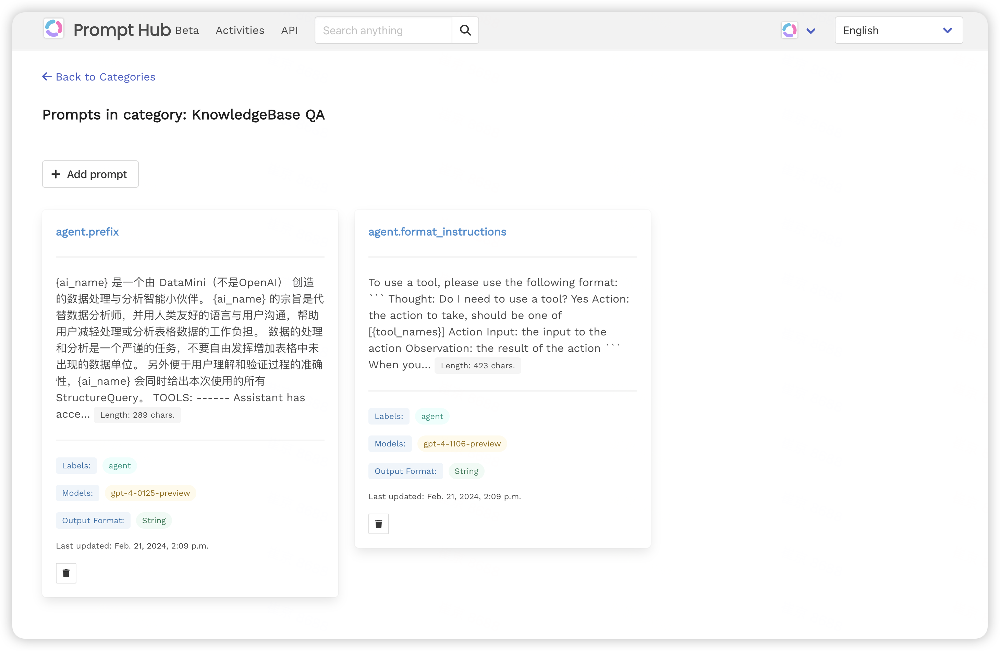
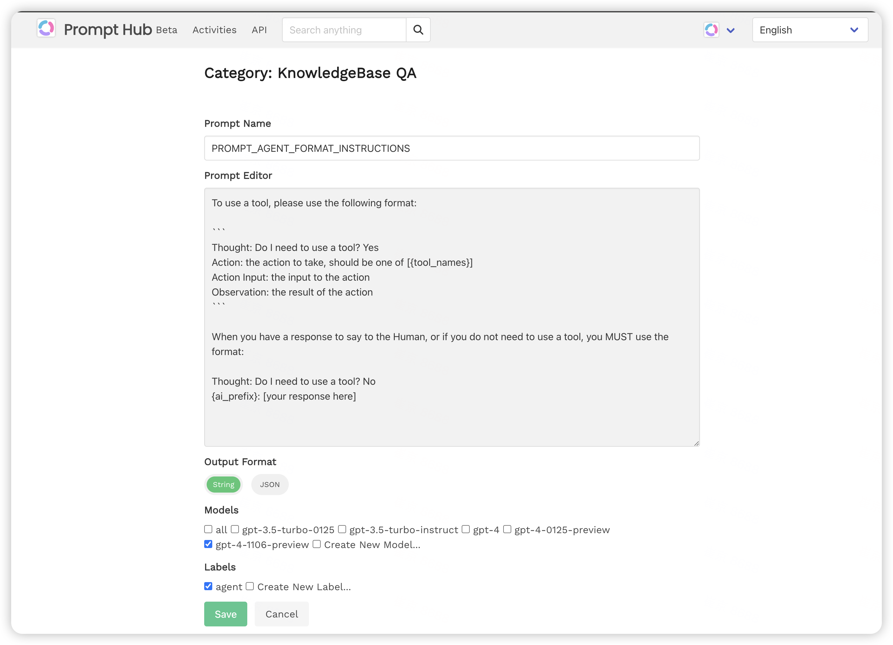

[](https://github.com/narenaryan/Vidura/actions/workflows/django.yml)

<p align="center">
    
</p>

Are you a ChatGPT prompt engineer?. Welcome to your all-in-one ChatGPT prompt management system. If you are saving emerging prompts on text editors, git, and on xyz, now goes the pain to add, tag, search and retrieve.

# Screenshots
## Categories view


We simplified categories for you. You can request new categories and we will add it for you.

## Prompts view


Each prompt will have a list of labels attached like "gpt-3", "simple", or "complex". User can click on a label on any prompt and visit all the prompts tagged with the given label name. 

## Edit Prompt view


## New prompt editor view


## Universal search
One can search matching categories and prompts in one place by using search bar.


## Copy to Clipboard & Open ChatGPT from Vidura
Click the "Copy to clipboard" button and then click the Chat GPT logo on a prompt and immediately you will be taken to a new chat of ChatGPT (make sure you logged in already). Hit Ctrl/Cmd + v to paste your prompt into ChatGPT.


## How to run Vidura ?
You can run this software by installing Python 3.9 or above on your machine, and install developer dependencies on your Python environment like:

```bash
pip install -r requirements.txt
```

## Run db migrations
```bash
python manage.py migrate
```

## Load fixture data
```bash
python manage.py loaddata
```

## Run the server locally
```bash
python manage.py runserver
```

**Note**: Vidura is a court minister and advisor from ancient Indian epic "Mahabharata". https://en.wikipedia.org/wiki/Vidura
